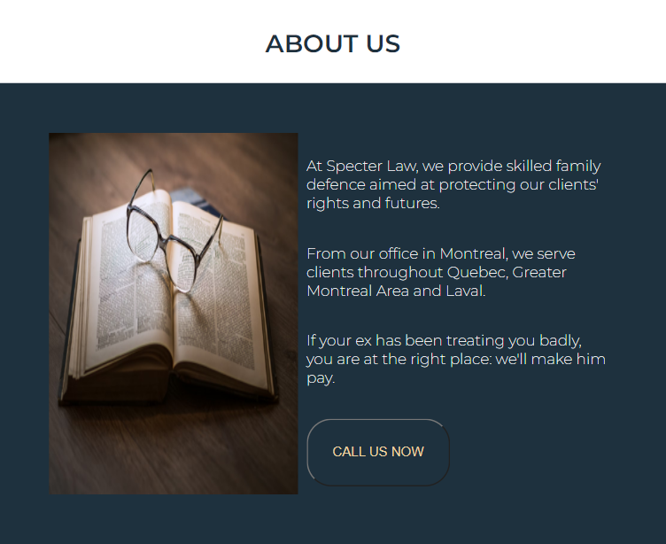
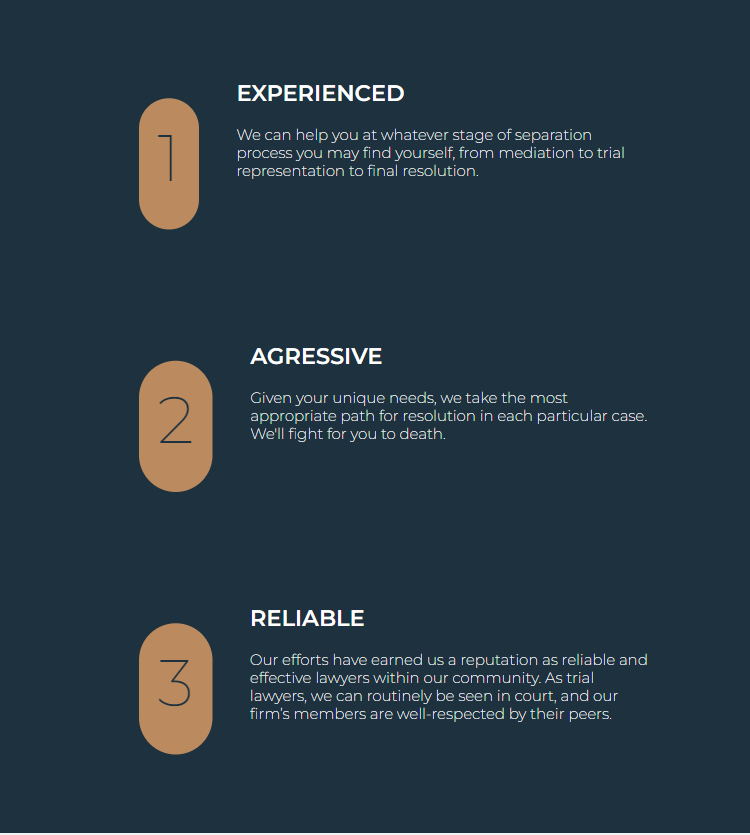
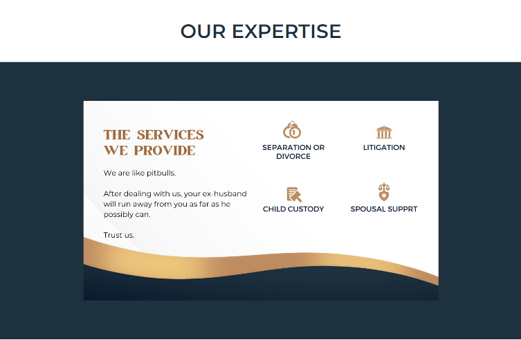
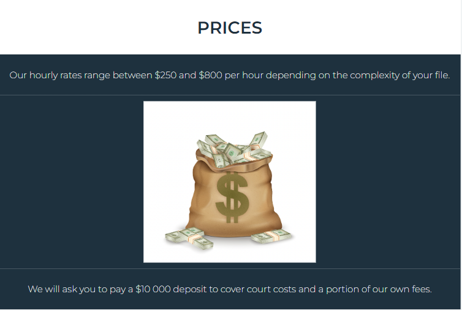
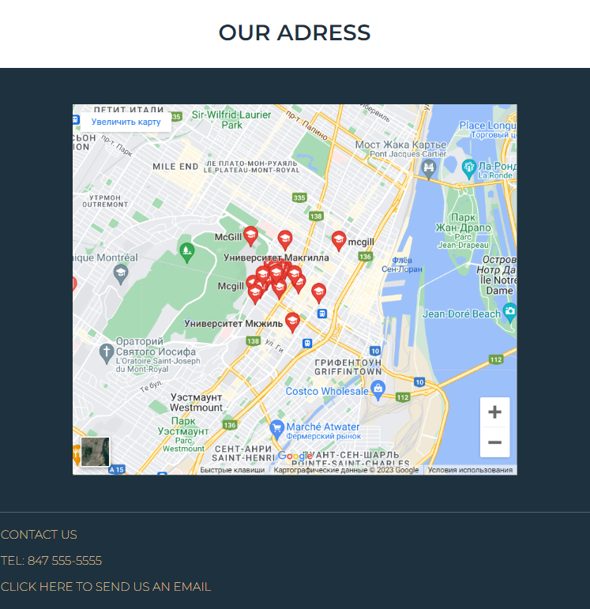

<h1 align="center"> <b>Layer Spencer</b></h1>

<h2 align="center">Hello! I'm Anastasiia Kucher 
</h2>

<h3 align="center">FullStack Developer and Project Manager from Ukraine!</h3>
<br> 
<h3 align="center">This project was built with the usage of HTML/CSS in order to place the Mr. Spencer layer's services. So it is easy for all the people who want to find the shelter of thruth and justice- apply for the services at this web-site. It is user-friendly page where everyone can easy to look through all the assistance, prices and even the office's location. </h3>  
<div align="center">


</div>

<p> <b> Easy steps to run the project:</b> </p> 

1. Wride down into the terminal this combination:

 git clone https://github.com/AnastassiiaKucher/lawyer.git

2. Open new terminal
3. code .
4. nmp start

<p> <b> Usage & Code listing: </b></p>

1. The header of the web-site, presenting the main sections like "About us", "Our services"and "Prices".


```
    <!--NAV-->
    <nav class="nav">
        <a class="item" href="#">About us</a>
        <a class="item" href="#">Our services</a>
        <a class="item" href="#">Prices</a>
    </nav>

    <!--COVER-->

    
```

2. The section where you can read more about the company and contact the office.


```
    <!--ABOUT US-->

    <div class="section-header">
        <h3 class="heading">About us</h3>
    </div>

    <div class="section-about">
        

        <div>
            <p class="about-us">At Specter Law, we provide skilled family defence aimed at protecting our clients' rights and futures. </p>
            <p class="about-us">From our office in Montreal, we serve clients throughout Quebec, Greater Montreal Area and Laval.</p>
            <p class="about-us">If your ex has been treating you badly, you are at the right place: we'll make him pay. </p>
        <button><a href="tel: +1-847-555-5555">CALL US NOW</a></button>
        </div>
    </div>
```

3. The section "Why our firm" can help the users to get to know the company more and to leave no doubt in order to choose right services.


```
        <!--WHY OUR FIRM-->

        <div class="section-header">
            <h3 class="heading">Why our firm?</h3>
        </div>

        <div class="wrapper">

            <div class="reason-block">
                <span class="spanspan">1</span>
                <div>
                    <h2>EXPERIENCED</h2>
                    <p>We can help you at whatever stage of separation process you may find yourself, from mediation to trial representation to final resolution.</p>
                </div>
            </div>

            <div class="reason-block">
                <span class="spanspan">2</span>
                <div>
                    <h2>AGRESSIVE</h2>
                    <p>Given your unique needs, we take the most appropriate path for resolution in each particular case. We'll fight for you to death.
                    </p>
                </div>
            </div>


            <div class="reason-block">
                <span class="spanspan">3</span>
                <div>
                    <h2>RELIABLE</h2>
                    <p>Our efforts have earned us a reputation as reliable and effective lawyers within our community. As trial lawyers, we can routinely be seen in court, and our firm’s members are well-respected by their peers.
                    </p>
                </div>
            </div>
        </div>
```
 
4. The section "Our expertise" can help the users to get to know the services' details.
    
```
        <!--OUR EXPERTISE-->

        <div class="section-header">
            <h3 class="heading">Our expertise</h3>
        </div>

        <div class="services">
            
        </div>
```
5. The section "Prices" can help the users to get to know more about the prices.
    
```
        <!--OUR PRICES-->
        <div class="section-header">
            <h3 class="heading">Prices</h3>
        </div>

        <div class="price">
            <p>Our hourly rates range between $250 and $800 per hour depending on the complexity of your file.</p>
        </div>

        <div class="price">

        </div>

        <div class="price">
        <p>We will ask you to pay a $10 000 deposit to cover court costs and a portion of our own fees.</p>
        </div>
```
6. The section "Adress" can help the users to get to find the office in easy way.
    
```

        <!--OUR ADRESS-->
        <div class="section-header">
            <h3 class="heading">Our adress</h3>
        </div>

            <div class="map">
        <div class="mapouter"><div class="gmap_canvas"><iframe width="600" height="500" id="gmap_canvas" src="https://maps.google.com/maps?q=McGill%20Unniversity&t=&z=13&ie=UTF8&iwloc=&output=embed" frameborder="0" scrolling="no" marginheight="0" marginwidth="0"></iframe><a href="https://123movies-to.org"></a><br><style>.mapouter{position:relative;text-align:right;height:500px;width:600px;}</style><a href="https://www.embedgooglemap.net">embedded google maps in website</a><style>.gmap_canvas {overflow:hidden;background:none!important;height:500px;width:600px;}</style></div></div>
            </div>
```
